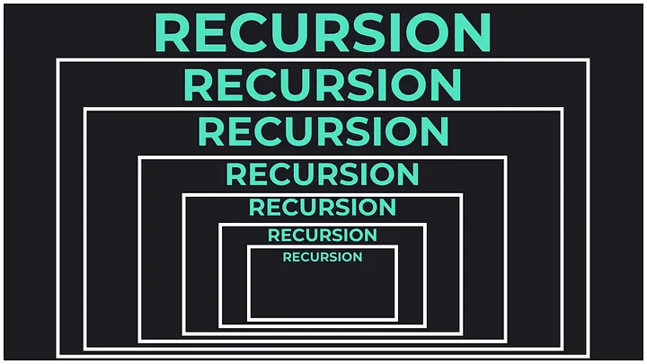
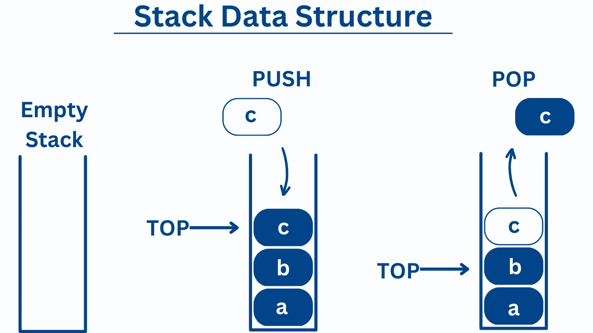

# 國立清華大學 - NTHU Online Judge

  

NTHU Online Judge is National Tsing Hua University’s programming/engineering practice platform used heavily in I2P (Introduction to Programming), and Data Structures. It supports languages like C/C++, Java and Python, provides auto-judging with test cases and scoreboards, and hosts a large archive of course problems and past assignments. Perfect for fast feedback, repeatable practice, and tracking progress across semesters.
 
This GitHub page collects our NTHU OJ materials in one place (solutions, practice sets, references, and step-by-step guides)
 

## !!! DISCLAIMER !!!
- This collection is not guaranteed to be complete.
- Some problems may contain answer keys or solutions, but accuracy is not guaranteed. Please use them as a reference only.
- Always double-check with official course materials or instructors when studying.
- We do not condone academic dishonesty (cheating, plagiarism, unauthorized collaboration). Use this repo responsibly. We are not liable for any consequences arising from misuse.
 
We hope this helps fellow students in their academic journey!

  

## Introduction - Hello, World!

  &ensp;
  
  
  
  &ensp;
  <a href="https://acm.cs.nthu.edu.tw/problem/14666"><strong>14666 - Chomusuke the Cat</strong></a>

  &ensp;
  
  
  
  &ensp;
  <a href="https://acm.cs.nthu.edu.tw/problem/14736"><strong>14736 - Chomusuke the Cat</strong></a>

  &ensp;
  
  
  
  &ensp;
  <a href="https://acm.cs.nthu.edu.tw/problem/14656"><strong>14656 - Cowboys and Horses</strong></a>

  &ensp;
  
  
  
  &ensp;
  <a href="https://acm.cs.nthu.edu.tw/problem/14662"><strong>14662 - Temperature Conversions</strong></a>

  &ensp;
  
  
  
  &ensp;
  <a href="https://acm.cs.nthu.edu.tw/problem/14665"><strong>14665 - Sky Diving</strong></a>

  &ensp;
  
  
  
  &ensp;
  <a href="https://acm.cs.nthu.edu.tw/problem/14676"><strong>14676 - Strict formatting</strong></a>

  &ensp;
  
  
  
  &ensp;
  <a href="https://acm.cs.nthu.edu.tw/problem/14691"><strong>14691 - Cowboys and Horses II</strong></a>

  &ensp;
  
  
  
  &ensp;
  <a href="https://acm.cs.nthu.edu.tw/problem/14730"><strong>14730 - I'm Buying</strong></a>

  &ensp;
  
  
  
  &ensp;
  <a href="https://acm.cs.nthu.edu.tw/problem/14737"><strong>14737 - Temperature Conversions II</strong></a>

 

## Slicing (Python)

  &ensp;
  
  
  
  &ensp;
  <a href="https://acm.cs.nthu.edu.tw/problem/14671"><strong>14671 - Gaura Nitai</strong></a>

  &ensp;
  
  
  
  &ensp;
  <a href="https://acm.cs.nthu.edu.tw/problem/14678"><strong>14678 - Is it palindrome?</strong></a>

  &ensp;
  
  
  
  &ensp;
  <a href="https://acm.cs.nthu.edu.tw/problem/14732"><strong>14732 - Is it palindrome?</strong></a>

  &ensp;
  
  
  
  &ensp;
  <a href="https://acm.cs.nthu.edu.tw/problem/14733"><strong>14733 - String Ninja</strong></a>

 

## List, Tuple, Dictionary, Set (Python)

  &ensp;
  
  
  
  &ensp;
  <a href="https://acm.cs.nthu.edu.tw/problem/14695"><strong>14695 - Domo the employee</strong></a>

  &ensp;
  
  
  
  &ensp;
  <a href="https://acm.cs.nthu.edu.tw/problem/14698"><strong>14698 - A boring article</strong></a>

  &ensp;
  
  
  
  &ensp;
  <a href="https://acm.cs.nthu.edu.tw/problem/14701"><strong>14701 - Gold Ship’s quiz</strong></a>

  &ensp;
  
  
  
  &ensp;
  <a href="https://acm.cs.nthu.edu.tw/problem/14705"><strong>14705 - Prez's puns</strong></a>

  &ensp;
  
  
  
  &ensp;
  <a href="https://acm.cs.nthu.edu.tw/problem/14710"><strong>14710 - Gold Ship’s quiz II</strong></a>

  &ensp;
  
  
  
  &ensp;
  <a href="https://acm.cs.nthu.edu.tw/problem/14751"><strong>14751 - Reorder Distance</strong></a>

 

## Binary/Bitwise

  &ensp;
  
  
  
  &ensp;
  <a href="https://acm.cs.nthu.edu.tw/problem/13376"><strong>13376 - bored cat</strong></a>

  &ensp;
  
  
  
  &ensp;
  <a href="https://acm.cs.nthu.edu.tw/problem/13403"><strong>13403 - Chicken Pu Translator</strong></a>

 

## String

  &ensp;
  
  
  
  &ensp;
  <a href="https://acm.cs.nthu.edu.tw/problem/12544"><strong>12544 - Simple Web Crawer</strong></a>

  &ensp;
  
  
  
  &ensp;
  <a href="https://acm.cs.nthu.edu.tw/problem/12612"><strong>12612 - Queries on a String</strong></a>

  &ensp;
  
  
  
  &ensp;
  <a href="https://acm.cs.nthu.edu.tw/problem/13312"><strong>13312 - Grab the Banana, Kris!</strong></a>

 

## Array

  &ensp;
  
  
  
  &ensp;
  <a href="https://acm.cs.nthu.edu.tw/problem/12883"><strong>12883 - Patrick and Spongebob in SAO</strong></a>

  &ensp;
  
  
  
  &ensp;
  <a href="https://acm.cs.nthu.edu.tw/problem/12913"><strong>12913 - Big number addition</strong></a>

  &ensp;
  
  
  
  &ensp;
  <a href="https://acm.cs.nthu.edu.tw/problem/13312"><strong>13312 - Grab the Banana, Kris!</strong></a>

  &ensp;
  
  
  
  &ensp;
  <a href="https://acm.cs.nthu.edu.tw/problem/13364"><strong>13364 - Mom, don't do that</strong></a>

  &ensp;
  
  
  
  &ensp;
  <a href="https://acm.cs.nthu.edu.tw/problem/13394"><strong>13394 - Spider-verse</strong></a>

  &ensp;
  
  
  
  &ensp;
  <a href="https://acm.cs.nthu.edu.tw/problem/13631"><strong>13631 - Nugget Frenzy</strong></a>

  &ensp;
  
  
  
  &ensp;
  <a href="https://acm.cs.nthu.edu.tw/problem/14673"><strong>14673 - The Cipher of Vyasa Dev</strong></a>

  &ensp;
  
  
  
  &ensp;
  <a href="https://acm.cs.nthu.edu.tw/problem/14754"><strong>14754 - Hang man</strong></a>

 

## 2D Array

  &ensp;
  
  
  
  &ensp;
  <a href="https://acm.cs.nthu.edu.tw/problem/12496"><strong>12496 - Eight Queen</strong></a>

  &ensp;
  
  
  
  &ensp;
  <a href="https://acm.cs.nthu.edu.tw/problem/12604"><strong>12604 - N-Queens M-Rooks Problem</strong></a>

  &ensp;
  
  
  
  &ensp;
  <a href="https://acm.cs.nthu.edu.tw/problem/13333"><strong>13333 - Stewie vs Brian</strong></a>

  &ensp;
  
  
  
  &ensp;
  <a href="https://acm.cs.nthu.edu.tw/problem/13361"><strong>13361 - Cardcaptor Sakura</strong></a>

  &ensp;
  
  
  
  &ensp;
  <a href="https://acm.cs.nthu.edu.tw/problem/13383"><strong>13383 - Cardcaptor Sakura2</strong></a>

  &ensp;
  
  
  
  &ensp;
  <a href="https://acm.cs.nthu.edu.tw/problem/13599"><strong>13599 - Find the amount of the pattern</strong></a>

  &ensp;
  
  
  
  &ensp;
  <a href="https://acm.cs.nthu.edu.tw/problem/13599"><strong>13648 - Text maze</strong></a>

  &ensp;
  
  
  
  &ensp;
  <a href="https://acm.cs.nthu.edu.tw/problem/13679"><strong>13679 - ZvP</strong></a>

  &ensp;
  
  
  
  &ensp;
  <a href="https://acm.cs.nthu.edu.tw/problem/13685"><strong>13685 - Hot-Cross-Bun</strong></a>

  &ensp;
  
  
  
  &ensp;
  <a href="https://acm.cs.nthu.edu.tw/problem/14016"><strong>14016 - OSHINOKODA</strong></a>

  &ensp;
  
  
  
  &ensp;
  <a href="https://acm.cs.nthu.edu.tw/problem/14722"><strong>14722 - Potato's Password I</strong></a>

  &ensp;
  
  
  
  &ensp;
  <a href="https://acm.cs.nthu.edu.tw/problem/14745"><strong>14745 - Potato's Password III</strong></a>

  &ensp;
  
  
  
  &ensp;
  <a href="https://acm.cs.nthu.edu.tw/problem/14786"><strong>14786 - Rotating Potato</strong></a>

 

## 3D Array

  &ensp;
  
  
  
  &ensp;
  <a href="https://acm.cs.nthu.edu.tw/problem/11711"><strong>11711 - Dynamic 3D array</strong></a>

 

## Sorting

  

  &ensp;
  
  
  
  &ensp;
  <a href="https://acm.cs.nthu.edu.tw/problem/13375"><strong>13375 - Class 3-E</strong></a>

  

## Recursion

  

<i>TO ITERATE IS HUMAN.   RECURSION, DIVINE</i>

 
Recursion a powerful mechanism to make your algorithm or codes more clear in some cases.
 
### Most commonly asked problems:
- Chess: 8 queens and other variations
- Making shapes with recursion

 
### Problem Set

  &ensp;
  
  
  
  &ensp;
  <a href="Solutions/12496_Eight_Queen"><strong>Solution</strong></a>&ensp;
  <a href="https://acm.cs.nthu.edu.tw/problem/12496"><strong>12496 - Eight Queen</strong></a>

  &ensp;
  
  
  
  &ensp;
  <a href="Solutions/12602_OuQ_String"><strong>Solution</strong></a>&ensp;
  <a href="https://acm.cs.nthu.edu.tw/problem/12602"><strong>12602 - OuQ String</strong></a>

  &ensp;
  
  
  
  &ensp;
  <a href="Solutions/13333_Stewie_vs_Brian"><strong>Solution</strong></a>&ensp;
  <a href="https://acm.cs.nthu.edu.tw/problem/13333"><strong>13333 - Stewie vs Brian</strong></a>

  &ensp;
  
  
  
  &ensp;
  <a href="Solutions/13680_Mr_Bean"><strong>Solution</strong></a>&ensp;
  <a href="https://acm.cs.nthu.edu.tw/problem/13680"><strong>13680 - Mr Bean</strong></a>

  &ensp;
  
  
  
  &ensp;
  <a href="Solutions/12604_N-Queens_M-Rooks_Problem"><strong>Solution</strong></a>&ensp;
  <a href="https://acm.cs.nthu.edu.tw/problem/12604"><strong>12604 - N-Queens M-Rooks Problem</strong></a>

  &ensp;
  
  
  
  &ensp;
  <a href="Solutions/13345_Domo_run!"><strong>Solution</strong></a>&ensp;
  <a href="https://acm.cs.nthu.edu.tw/problem/13345"><strong>13345 - Domo run!</strong></a>

  &ensp;
  
  
  
  &ensp;
  <a href="Solutions/13337_Karpet_Sierpinski"><strong>Solution</strong></a>&ensp;
  <a href="https://acm.cs.nthu.edu.tw/problem/13337"><strong>13337 - Karpet Sierpinski</strong></a>

  &ensp;
  
  
  
  &ensp;
  <a href="Solutions/13339_Karpet_Ribet"><strong>Solution</strong></a>&ensp;
  <a href="https://acm.cs.nthu.edu.tw/problem/13339"><strong>13339 - Karpet Ribet</strong></a>

  &ensp;
  
  
  
  &ensp;
  <a href="Solutions/13349_Karpet_Agak_Ribet"><strong>Solution</strong></a>&ensp;
  <a href="https://acm.cs.nthu.edu.tw/problem/13349"><strong>13349 - Karpet Agak Ribet</strong></a>

  &ensp;
  
  
  
  &ensp;
  <a href="Solutions/13628_Elsa's_curse"><strong>Solution</strong></a>&ensp;
  <a href="https://acm.cs.nthu.edu.tw/problem/13628"><strong>13628 - Elsa's curse</strong></a>

  &ensp;
  
  
  
  &ensp;
  <a href="Solutions/14029_Piece_of_a_Dragon_Curve"><strong>Solution</strong></a>&ensp;
  <a href="https://acm.cs.nthu.edu.tw/problem/14029"><strong>14029 - Piece of a Dragon Curve</strong></a>

  &ensp;
  
  
  
  &ensp;
  <a href="Solutions/14498_Hilbert_Curve"><strong>Solution</strong></a>&ensp;
  <a href="https://acm.cs.nthu.edu.tw/problem/14498"><strong>14498 - Hilbert Curve</strong></a>

  

## Linked-List

  

A linked list are nodes that no longer continue in the memory and each node stores the address or location of
the next one.
 
### Most commonly asked problems:
- Linked-List Operations: Insert, delete, reverse
- Implement Stack with Linked-List
- Implement Queue with Linked-List
- Tree/Graph
 
### Problem Set

  &ensp;
  
  
  
  &ensp;
  <a href="Solutions/13129_Prize!"><strong>Solution</strong></a>&ensp;
  <a href="https://acm.cs.nthu.edu.tw/problem/13129"><strong>13129 - Prize!</strong></a>

  &ensp;
  
  
  
  &ensp;
  <a href="Solutions/13391_Domo_the_Train_Conductor"><strong>Solution</strong></a>&ensp;
  <a href="https://acm.cs.nthu.edu.tw/problem/13391"><strong>13391 - Domo the Train Conductor </strong></a>

  &ensp;
  
  
  
  &ensp;
  <a href="Solutions/14664_DS_HW1_String_Manipulation"><strong>Solution</strong></a>&ensp;
  <a href="https://acm.cs.nthu.edu.tw/problem/14664"><strong>14664 - DS HW1 String Manipulation</strong></a>

  &ensp;
  
  
  
  &ensp;
  <a href="Solutions/14741_DS_Quiz1_A_ticket_counter_queue"><strong>Solution</strong></a>&ensp;
  <a href="https://acm.cs.nthu.edu.tw/problem/14741"><strong>14741 - DS Quiz1 A ticket counter queue</strong></a>

  &ensp;
  
  
  
  &ensp;
  <a href="Solutions/13412_I_hate_Christmas"><strong>Solution</strong></a>&ensp;
  <a href="https://acm.cs.nthu.edu.tw/problem/13412"><strong>13412 - I hate Christmas </strong></a>

  &ensp;
  
  
  
  &ensp;
  <a href="Solutions/14584_Lantern_Festival"><strong>Solution</strong></a>&ensp;
  <a href="https://acm.cs.nthu.edu.tw/problem/14584"><strong>14584 - Lantern Festival</strong></a>

  

## Stack

  

A stack is a specialized ordered list in which insertions (or called additions or pushes) and deletions (or called removals or pops) are made at one end called the top.
 
Stack is a FILO/LIFO data structure.
 
### Most commonly asked problems:
- Transform Infix to Postfix
- Transform Infix to Prefix
- Transform Postfix to Prefix
- Transform Prefix to Postfix
 
### Problem Set

  &ensp;
  
  
  
  &ensp;
  <a href="Solutions/13342_Domo_to_omoD"><strong>Solution</strong></a>&ensp;
  <a href="https://acm.cs.nthu.edu.tw/problem/13342"><strong>13342 - Domo to omoD</strong></a>

  &ensp;
  
  
  
  &ensp;
  <a href="Solutions/13693_Domo_sonnan_ja_dame"><strong>Solution</strong></a>&ensp;
  <a href="https://acm.cs.nthu.edu.tw/problem/13693"><strong>13693 - Domo sonnan ja dame</strong></a>

  &ensp;
  
  
  
  &ensp;
  <a href="Solutions/14724_DS_HW2_Arithmetic_Evaluation"><strong>Solution</strong></a>&ensp;
  <a href="https://acm.cs.nthu.edu.tw/problem/14724"><strong>14724 - DS HW2 Arithmetic Evaluation</strong></a>

  &ensp;
  
  
  
  &ensp;
  <a href="Solutions/14782_Arithmetic_Expression_Infix_to_Postfix_Notation"><strong>Solution</strong></a>&ensp;
  <a href="https://acm.cs.nthu.edu.tw/problem/14782"><strong>14782 - Arithmetic Expression - Infix to Postfix Notation</strong></a>

 

## Prefix-Sum

  &ensp;
  
  
  
  &ensp;
  <a href="https://acm.cs.nthu.edu.tw/problem/14016"><strong>14016 - OSHINOKODA</strong></a>

 

## Sliding Window

  &ensp;
  
  
  
  &ensp;
  <a href="https://acm.cs.nthu.edu.tw/problem/14728"><strong>14728 - Word Puzzle</strong></a>

 

## Dynamic Programming

  &ensp;
  
  
  
  &ensp;
  <a href="https://acm.cs.nthu.edu.tw/problem/13346"><strong>13346 - DomoMaze</strong></a>

  &ensp;
  
  
  
  &ensp;
  <a href="https://acm.cs.nthu.edu.tw/problem/13348"><strong>13348 - DomoMaze - easy version</strong></a>

 

## Breadth-First-Search (BFS)

  &ensp;
  
  
  
  &ensp;
  <a href="https://acm.cs.nthu.edu.tw/problem/13436"><strong>13436 - Remove the leaves</strong></a>

 

## Tree

  &ensp;
  
  
  
  &ensp;
  <a href="https://acm.cs.nthu.edu.tw/problem/13436"><strong>13436 - Remove the leaves</strong></a>

